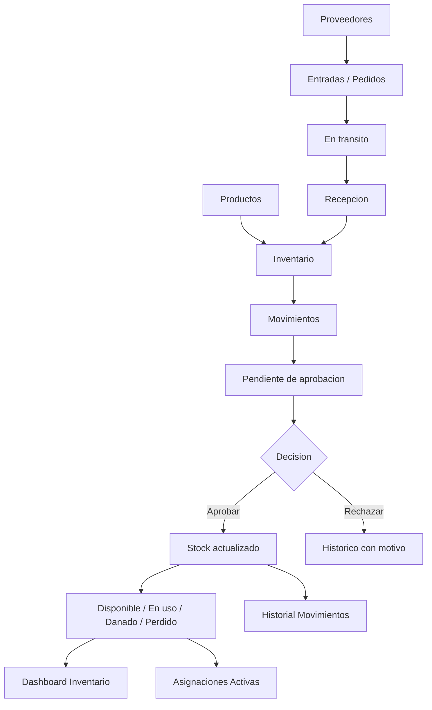

# Analisis Funcional AS-IS - Modulo de Logistica

Fecha: 2026-05-31

## 1. Objetivo del documento

Este documento describe funcionalmente el estado actual del modulo de Logistica de la aplicacion Toshify. El objetivo es dejar documentado como funciona hoy el modulo, que pantallas lo componen, que procesos cubre, que actores intervienen, que reglas de negocio aplica y que dependencias funcionales existen entre sus partes.

Este documento no es una propuesta de mejora. Es una descripcion AS-IS del comportamiento funcional actual observado en el codigo existente.

## 2. Alcance funcional revisado

El modulo de Logistica esta compuesto por las siguientes opciones de menu y pages:

| Opcion de menu | Ruta | Page | Modulo funcional |
| --- | --- | --- | --- |
| Dashboard Inventario | `/logistica/inventario/dashboard` | `InventarioDashboardPage` | `InventarioDashboardModule` |
| Proveedores | `/logistica/proveedores` | `ProveedoresPage` | `ProveedoresModule` |
| Productos | `/logistica/productos` | `ProductosPage` | `ProductosModule` |
| Asignaciones Activas | `/logistica/inventario/asignaciones-activas` | `AsignacionesActivasPage` | `AsignacionesActivasModule` |
| Movimientos | `/logistica/inventario/movimientos` | `MovimientosPage` | `MovimientosModule` |
| Pedidos | `/logistica/inventario/pedidos` | `PedidosPage` | `PedidosUnificadoModule` |
| Historial | `/logistica/inventario/historial` | `HistorialMovimientosPage` | `HistorialMovimientosModule` |

Tambien existen dos pages/modulos relacionados que no aparecen como opciones principales dentro del menu revisado, pero forman parte historica o funcional del dominio de inventario:

| Page | Modulo | Observacion funcional |
| --- | --- | --- |
| `AprobacionesPendientesPage` | `AprobacionesPendientesModule` | Maneja aprobaciones e historico de aprobaciones por separado. Su funcionalidad esta integrada parcialmente en `PedidosUnificadoModule`. |
| `PedidosTransitoPage` | `PedidosTransitoModule` | Maneja entradas y pedidos en transito por separado. Su funcionalidad esta integrada parcialmente en `PedidosUnificadoModule`. |

## 3. Resumen funcional general

El modulo de Logistica permite administrar el inventario operativo de la organizacion. Cubre los siguientes bloques funcionales:

1. Catalogo de productos.
2. Catalogo de proveedores.
3. Consulta consolidada de stock.
4. Registro de movimientos de inventario.
5. Registro de entradas simples y pedidos en transito.
6. Recepcion de productos.
7. Aprobacion o rechazo de movimientos.
8. Control de herramientas asignadas a vehiculos.
9. Consulta historica de movimientos.

El modulo trabaja principalmente sobre productos de dos tipos:

- Repuestos.
- Herramientas.

Las herramientas se consideran retornables y pueden asignarse a vehiculos. Los repuestos se tratan como productos consumibles o de stock.

## 4. Actores funcionales identificados

### 4.1 Usuario con permiso de visualizacion

Puede ingresar a las pages a las que tenga permiso por menu/submenu. Puede consultar dashboard, productos, proveedores, asignaciones, pedidos o historial segun permisos asignados.

### 4.2 Usuario operador de movimientos

Usuario con permiso de creacion sobre `inventario-movimientos`. Puede registrar entradas, salidas, asignaciones y devoluciones.

### 4.3 Usuario encargado, supervisor o admin

Usuario cuyo rol permite aprobar movimientos pendientes. En `PedidosUnificadoModule`, la capacidad funcional de aprobacion se determina por rol:

- `encargado`
- `admin`
- `supervisor`

Adicionalmente, para aprobar o rechazar se valida permiso de edicion sobre el submenu de pedidos.

### 4.4 Usuario administrador de catalogos

Usuario con permisos de creacion, edicion o eliminacion sobre:

- `productos`
- `proveedores`

Puede mantener maestros de productos y proveedores.

## 5. Dependencias funcionales principales

### 5.1 Contextos y permisos

El modulo depende del sistema general de permisos:

- `canCreateInSubmenu`
- `canEditInSubmenu`
- `canDeleteInSubmenu`

Estos permisos se usan para habilitar o bloquear acciones como crear, editar, eliminar, registrar movimientos, aprobar y confirmar recepciones.

### 5.2 Contexto de sede

El modulo de Movimientos usa el contexto de sede para filtrar vehiculos disponibles mediante `aplicarFiltroSede`. Esto afecta la seleccion de vehiculos en movimientos asociados a una sede.

No se observa en todas las pantallas una aplicacion funcional equivalente del filtro de sede al stock o al dashboard de inventario.

### 5.3 Base de datos, vistas y RPC

El modulo se apoya en tablas, vistas y funciones RPC de Supabase. Las referencias funcionales observadas incluyen:

Tablas principales:

- `productos`
- `proveedores`
- `inventario`
- `movimientos`
- `pedido_items`
- `vehiculos`
- `user_profiles`
- `categorias`
- `unidades_medida`
- `productos_estados`

Vistas principales:

- `v_stock_productos`
- `v_entradas_en_transito`
- `v_pedidos_en_transito`
- `v_movimientos_pendientes`

RPC principales:

- `procesar_movimiento_inventario`
- `crear_pedido_inventario`
- `confirmar_recepcion_entrada`
- `procesar_recepcion_pedido`
- `aprobar_rechazar_movimiento`

## 6. Modelo funcional de entidades

### 6.1 Producto

Entidad maestra del inventario. Sus datos funcionales actuales incluyen:

- Codigo.
- Nombre.
- Descripcion.
- Unidad de medida.
- Estado.
- Categoria.
- Tipo.
- Indicador retornable.
- Proveedor textual.
- Observacion.
- Stock minimo.
- Alerta de reposicion.
- Fecha de creacion.
- Fecha de actualizacion.

Regla funcional observada:

- Si el tipo es `HERRAMIENTAS`, el producto se considera retornable.
- Si el tipo es `REPUESTOS`, se comporta como producto de consumo o stock.

### 6.2 Proveedor

Entidad maestra de terceros proveedores. Sus datos funcionales actuales incluyen:

- Razon social.
- Tipo de documento.
- Numero de documento.
- Telefono.
- Email.
- Direccion.
- Informacion de pago.
- Observaciones.
- Categoria.
- Estado activo/inactivo.
- Fecha de creacion.
- Fecha de actualizacion.

Regla funcional observada:

- El proveedor no se elimina fisicamente desde la operacion normal. Se desactiva y puede reactivarse.

### 6.3 Inventario

Representa stock fisico o logico de productos. Maneja cantidades en diferentes estados:

- Disponible.
- En uso.
- En transito.
- Danado.
- Perdido.

El dashboard consolida estos estados para mostrar la situacion del inventario por producto.

### 6.4 Movimiento

Representa una operacion que modifica o solicita modificar el stock. Tipos funcionales:

- Entrada.
- Salida.
- Asignacion.
- Devolucion.

Los movimientos pueden tener estado de aprobacion:

- Pendiente.
- Aprobado.
- Rechazado.

### 6.5 Pedido

Representa una entrada por lote o una compra/recepcion en transito. Se identifica por numero de pedido y proveedor, y contiene items con cantidades pedidas, recibidas y pendientes.

### 6.6 Asignacion activa

Representa herramientas actualmente en uso, asociadas a un vehiculo.

## 7. Navegacion funcional actual

El usuario accede al modulo desde el menu lateral "Logistica". Dentro de este menu se observan las opciones:

1. Dashboard Inventario.
2. Proveedores.
3. Productos.
4. Asignaciones Activas.
5. Movimientos.
6. Pedidos.

Adicionalmente existe ruta para Historial:

- `/logistica/inventario/historial`

La navegacion y acceso a cada ruta estan protegidos por `ProtectedRoute`, validando permisos de submenu.

## 8. Descripcion funcional por pantalla

### 8.1 Dashboard Inventario

#### Proposito

Permite consultar el estado general del inventario y visualizar cantidades por producto, categoria y estado de stock.

#### Informacion mostrada

Tarjetas superiores por categoria:

- Todos.
- Maquinaria.
- Herramientas.
- Repuestos.
- Insumos.

Tarjetas de estado de stock:

- Productos.
- Disponible.
- En uso.
- En transito.
- Danado.
- Perdido.

Tabla de productos en inventario:

- Codigo.
- Producto.
- Unidad.
- Tipo.
- Total.
- Disponible.
- En uso.
- En transito.
- Danado.
- Perdido.

#### Filtros y busqueda

La pantalla permite:

- Buscar por codigo o producto.
- Filtrar por codigo.
- Filtrar por producto.
- Filtrar por tipo.
- Filtrar usando tarjetas de estado de stock.

#### Reglas funcionales

- Solo se consideran productos con stock en disponible, en uso o en transito.
- El total mostrado se calcula como disponible + en uso + en transito.
- Danado y perdido se muestran como estados separados y no forman parte del total operativo.
- Si el stock disponible es menor o igual al stock minimo, se muestra alerta visual.

#### Resultado funcional

El usuario puede conocer la disponibilidad y distribucion actual del inventario, identificar productos con bajo stock y filtrar por estados operativos.

### 8.2 Productos

#### Proposito

Permite mantener el catalogo maestro de productos utilizados por Logistica.

#### Funcionalidades

- Listar productos.
- Buscar productos.
- Filtrar por codigo.
- Filtrar por nombre.
- Filtrar por tipo.
- Crear producto.
- Editar producto.
- Ver detalle de producto.
- Eliminar producto si no tiene dependencias.

#### Datos gestionados

- Codigo.
- Nombre.
- Descripcion.
- Unidad de medida.
- Estado.
- Categoria.
- Tipo.
- Proveedor.
- Observacion.
- Stock minimo.
- Alerta de reposicion.

#### Reglas funcionales

- Para crear o editar se requieren datos obligatorios como codigo, nombre, unidad de medida y categoria.
- Al crear o editar, `es_retornable` queda asociado al tipo del producto.
- Si el producto tiene registros en inventario, no se permite eliminar.
- Si el producto tiene pedidos asociados, no se permite eliminar.
- Si el usuario no tiene permisos, no puede crear, editar ni eliminar.

#### Resultado funcional

El usuario mantiene el catalogo de productos que luego se utiliza en movimientos, pedidos, dashboard y asignaciones.

### 8.3 Proveedores

#### Proposito

Permite administrar el maestro de proveedores utilizados en entradas, pedidos y abastecimiento.

#### Funcionalidades

- Listar proveedores.
- Buscar proveedores.
- Filtrar por razon social.
- Filtrar por categoria.
- Filtrar por estado.
- Crear proveedor.
- Editar proveedor.
- Ver detalle.
- Desactivar proveedor.
- Reactivar proveedor.

#### Datos gestionados

- Razon social.
- Tipo de documento.
- Numero de documento.
- Telefono.
- Email.
- Direccion.
- Informacion de pago.
- Observaciones.
- Categoria.
- Estado activo/inactivo.

#### Reglas funcionales

- La eliminacion funcional es un soft delete: el proveedor se marca como inactivo.
- Los proveedores inactivos no aparecen en listas operativas donde se requiere proveedor activo.
- Un proveedor inactivo puede reactivarse.
- Las acciones dependen de permisos del submenu `proveedores`.

#### Resultado funcional

El usuario mantiene proveedores disponibles para entradas y pedidos de inventario.

### 8.4 Movimientos

#### Proposito

Permite registrar operaciones de inventario.

#### Tipos de movimiento disponibles

1. Entrada.
2. Salida.
3. Uso de herramienta / asignacion.
4. Devolucion.

#### Entrada

La entrada registra productos que ingresan al circuito logistico. Actualmente las entradas quedan en estado de transito y requieren confirmacion posterior de recepcion desde Pedidos.

Modalidades:

- Entrada simple.
- Entrada por lote/pedido.

Campos relevantes:

- Proveedor.
- Numero de pedido o referencia.
- Fecha estimada de llegada.
- Producto.
- Cantidad.
- Observaciones.

Reglas:

- Requiere proveedor.
- En lote, requiere al menos un producto.
- En lote, si se registra en transito, requiere numero de pedido.
- El sistema informa que los productos ingresaran como "En Transito".

#### Salida

La salida registra egreso o consumo de productos.

Motivos actuales:

- Venta.
- Consumo en servicio.
- Danado.
- Perdido.

Campos relevantes:

- Producto.
- Cantidad.
- Proveedor.
- Vehiculo opcional.
- Motivo de salida.
- Categoria de servicio si el motivo es consumo en servicio.
- Observaciones.

Reglas:

- Requiere producto y cantidad valida.
- Requiere proveedor.
- Requiere motivo de salida.
- Si el motivo es consumo en servicio, requiere categoria de servicio.
- Valida stock disponible.
- Queda pendiente de aprobacion.

#### Uso de herramienta / asignacion

Permite asignar herramientas a vehiculos.

Campos relevantes:

- Producto.
- Cantidad.
- Proveedor.
- Vehiculo destino.
- Categoria de servicio.
- Observaciones.

Reglas:

- Solo se pueden asignar productos retornables/herramientas.
- Requiere vehiculo.
- Requiere categoria de servicio.
- Requiere proveedor.
- Valida stock disponible.
- Queda pendiente de aprobacion.

#### Devolucion

Permite registrar la devolucion de herramientas desde un vehiculo.

Campos relevantes:

- Vehiculo origen.
- Producto.
- Cantidad.
- Estado de retorno.
- Categoria de servicio.
- Observaciones.

Estados de retorno:

- Operativa.
- Danada.
- Perdida.

Reglas:

- Requiere vehiculo.
- Requiere estado de retorno.
- Si el estado es danada o perdida, requiere observaciones.
- Queda pendiente de aprobacion.

#### Resultado funcional

La pantalla concentra la carga operativa de movimientos. Las entradas pasan por transito/recepcion. Las salidas, asignaciones y devoluciones requieren aprobacion.

### 8.5 Pedidos

#### Proposito

Unifica la gestion de entradas en transito, pedidos, aprobaciones pendientes e historico.

#### Tabs actuales

1. Entradas.
2. Pedidos.
3. Pendientes.
4. Historico.

#### Tab Entradas

Muestra entradas simples en transito pendientes de recepcion.

Informacion visible:

- Producto.
- Proveedor.
- Cantidad.
- Fecha.
- Aprobado por.
- Accion de recepcionar.

Accion principal:

- Confirmar recepcion.

Reglas:

- La cantidad recibida debe ser mayor a cero.
- La cantidad recibida no puede exceder la cantidad en transito.
- Se permite recepcion parcial.

#### Tab Pedidos

Muestra pedidos en transito agrupados por numero de pedido.

Informacion visible:

- Numero de pedido.
- Proveedor.
- Fecha de pedido.
- Fecha estimada de llegada.
- Estado del pedido.
- Items del pedido.
- Cantidad pendiente por item.

Accion principal:

- Confirmar recepcion de item.

Reglas:

- La cantidad recibida debe ser valida.
- No puede superar la cantidad pendiente.
- Se permite recepcion parcial.

#### Tab Pendientes

Muestra movimientos pendientes de aprobacion.

Tipos incluidos:

- Entrada.
- Salida.
- Asignacion.
- Devolucion.

Acciones:

- Ver detalle.
- Aprobar.
- Rechazar.

Reglas:

- Solo usuarios con rol encargado, admin o supervisor pueden ver/cargar aprobaciones.
- Para aprobar o rechazar se requiere permiso de edicion del submenu `pedidos`.
- Al rechazar, el motivo es obligatorio y debe tener al menos 10 caracteres.
- Al aprobar, se ejecuta la logica centralizada de aprobacion y actualizacion de stock.

#### Tab Historico

Muestra aprobaciones y rechazos procesados.

Informacion visible:

- Tipo de movimiento.
- Producto.
- Cantidad.
- Usuario registrador.
- Usuario aprobador.
- Fecha.
- Estado aprobado/rechazado.
- Motivo de rechazo cuando aplica.

#### Resultado funcional

La pantalla de Pedidos funciona como bandeja operativa para recepcionar mercaderia y aprobar movimientos que afectan stock.

### 8.6 Asignaciones Activas

#### Proposito

Permite consultar herramientas actualmente asignadas a vehiculos.

#### Informacion mostrada

- Vehiculo.
- Marca/modelo.
- Codigo de producto.
- Herramienta.
- Cantidad.
- Fecha de asignacion.

#### Indicadores

- Vehiculos con asignaciones.
- Total de herramientas asignadas.

#### Filtros

- Patente/vehiculo.
- Herramienta/producto.
- Busqueda general.

#### Reglas funcionales

- Consulta registros de inventario en estado `en_uso`.
- Solo muestra registros asociados a un vehiculo.

#### Resultado funcional

El usuario puede consultar que herramientas estan actualmente en uso y en que vehiculo se encuentran.

### 8.7 Historial de Movimientos

#### Proposito

Permite consultar movimientos historicos recientes del inventario.

#### Informacion mostrada

- Fecha.
- Tipo de movimiento.
- Producto.
- Cantidad.
- Vehiculo.
- Usuario.
- Observaciones.

#### Filtros

- Tipo de movimiento.
- Producto.
- Vehiculo.
- Usuario.
- Busqueda general.

#### Reglas funcionales

- La consulta actual limita el historial a los ultimos 100 movimientos.
- Ordena por fecha de creacion descendente.

#### Resultado funcional

El usuario puede revisar movimientos recientes y filtrar para encontrar operaciones especificas.

## 9. Flujos funcionales actuales

### 9.1 Alta de producto

1. Usuario ingresa a Productos.
2. Selecciona crear producto.
3. Completa datos obligatorios.
4. Define tipo: repuesto o herramienta.
5. Define unidad, categoria, estado y parametros de stock.
6. Guarda.
7. El producto queda disponible para movimientos y pedidos.

### 9.2 Alta de proveedor

1. Usuario ingresa a Proveedores.
2. Selecciona crear proveedor.
3. Completa datos fiscales/contacto/operativos.
4. Guarda.
5. El proveedor queda activo y disponible para entradas y pedidos.

### 9.3 Entrada simple

1. Usuario ingresa a Movimientos.
2. Selecciona Entrada.
3. Selecciona proveedor.
4. Ingresa referencia/pedido.
5. Selecciona producto y cantidad.
6. Confirma movimiento.
7. El producto queda en transito.
8. La recepcion se confirma desde Pedidos.

### 9.4 Entrada por lote/pedido

1. Usuario ingresa a Movimientos.
2. Selecciona Entrada.
3. Activa modo lote.
4. Selecciona proveedor.
5. Ingresa numero de pedido.
6. Agrega multiples productos y cantidades.
7. Confirma.
8. Se crea pedido en transito.
9. Cada item queda pendiente de recepcion.

### 9.5 Recepcion de entrada

1. Usuario ingresa a Pedidos.
2. Abre tab Entradas o Pedidos.
3. Selecciona item pendiente.
4. Informa cantidad recibida.
5. El sistema valida que no exceda la cantidad pendiente.
6. Confirma recepcion.
7. El stock recibido pasa al circuito disponible segun la logica RPC.

### 9.6 Salida de producto

1. Usuario ingresa a Movimientos.
2. Selecciona Salida.
3. Define motivo.
4. Si corresponde, define categoria de servicio.
5. Selecciona producto, proveedor y cantidad.
6. Opcionalmente asocia vehiculo.
7. El sistema valida stock.
8. Se registra movimiento pendiente.
9. Encargado/supervisor/admin aprueba o rechaza.
10. Si aprueba, se actualiza stock.

### 9.7 Salida por lote

1. Usuario ingresa a Movimientos.
2. Selecciona Salida.
3. Activa modo lote.
4. Agrega productos, cantidades y vehiculos.
5. Confirma.
6. Se crean movimientos pendientes por cada item.
7. La aprobacion se realiza desde Pedidos.

### 9.8 Asignacion de herramienta

1. Usuario ingresa a Movimientos.
2. Selecciona Uso de Herramienta.
3. Selecciona herramienta retornable.
4. Selecciona vehiculo.
5. Selecciona proveedor.
6. Define cantidad y categoria de servicio.
7. El sistema valida stock.
8. Se registra movimiento pendiente.
9. Al aprobarse, la herramienta queda en uso asociada al vehiculo.
10. La asignacion aparece en Asignaciones Activas.

### 9.9 Devolucion de herramienta

1. Usuario ingresa a Movimientos.
2. Selecciona Devolucion.
3. Selecciona vehiculo.
4. El sistema carga herramientas asignadas al vehiculo.
5. Selecciona herramienta.
6. Define estado de retorno.
7. Si esta danada o perdida, debe registrar observaciones.
8. Se registra movimiento pendiente.
9. Encargado/supervisor/admin aprueba o rechaza.
10. Si aprueba, el stock se actualiza segun estado de retorno.

### 9.10 Aprobacion de movimiento

1. Usuario autorizado ingresa a Pedidos.
2. Abre tab Pendientes.
3. Revisa detalle del movimiento.
4. Aprueba o rechaza.
5. Si aprueba, se ejecuta `aprobar_rechazar_movimiento`.
6. Si rechaza, debe informar motivo.
7. El movimiento pasa al historico.

### 9.11 Consulta historica

1. Usuario ingresa a Historial.
2. Consulta ultimos movimientos.
3. Filtra por tipo, producto, vehiculo o usuario.
4. Revisa fecha, cantidad, observaciones y usuario asociado.

## 10. Reglas de negocio identificadas

### 10.1 Permisos

- Cada page esta protegida por permisos de menu/submenu.
- Crear productos depende de permiso de creacion sobre `productos`.
- Editar productos depende de permiso de edicion sobre `productos`.
- Eliminar productos depende de permiso de eliminacion sobre `productos`.
- Crear proveedores depende de permiso de creacion sobre `proveedores`.
- Editar proveedores depende de permiso de edicion sobre `proveedores`.
- Desactivar proveedores depende de permiso de eliminacion sobre `proveedores`.
- Registrar movimientos depende de permiso de creacion sobre `inventario-movimientos`.
- Confirmar recepciones y aprobar movimientos dependen de permiso de edicion sobre `pedidos`.

### 10.2 Productos

- Un producto no se elimina si tiene registros asociados en inventario.
- Un producto no se elimina si tiene pedidos asociados.
- Las herramientas son productos retornables.
- Los repuestos no se tratan como retornables.

### 10.3 Proveedores

- Los proveedores se desactivan, no se eliminan fisicamente.
- Los proveedores inactivos pueden reactivarse.
- En movimientos operativos solo se cargan proveedores activos.

### 10.4 Movimientos

- Entrada requiere proveedor.
- Salida requiere proveedor y motivo.
- Salida por consumo de servicio requiere categoria de servicio.
- Asignacion requiere herramienta retornable.
- Asignacion requiere vehiculo.
- Asignacion requiere categoria de servicio.
- Devolucion requiere vehiculo.
- Devolucion requiere estado de retorno.
- Devolucion danada o perdida requiere observaciones.
- Salida y asignacion validan stock disponible.
- Todo movimiento distinto de entrada requiere aprobacion.

### 10.5 Recepcion

- La cantidad recibida debe ser mayor a cero.
- La cantidad recibida no puede superar la cantidad pendiente.
- Se permite recepcion parcial.

### 10.6 Aprobacion

- Solo roles encargado, supervisor y admin pueden operar aprobaciones.
- El rechazo requiere motivo minimo de 10 caracteres.
- La aprobacion ejecuta logica centralizada que actualiza el stock.

## 11. Estados funcionales actuales

### 11.1 Estados de stock

| Estado | Significado funcional |
| --- | --- |
| Disponible | Stock disponible para salida o asignacion. |
| En uso | Herramientas o productos actualmente asociados a uso/vehiculo. |
| En transito | Productos ingresados pero pendientes de recepcion. |
| Danado | Productos o herramientas marcados como danados. |
| Perdido | Productos o herramientas marcados como perdidos. |

### 11.2 Estados de aprobacion

| Estado | Significado funcional |
| --- | --- |
| Pendiente | Movimiento registrado pero no aprobado. |
| Aprobado | Movimiento aceptado y procesado. |
| Rechazado | Movimiento rechazado con motivo. |

### 11.3 Estados de retorno

| Estado | Significado funcional |
| --- | --- |
| Operativa | Herramienta vuelve en condiciones de uso. |
| Danada | Herramienta vuelve con dano. Requiere observacion. |
| Perdida | Herramienta no retorna. Requiere observacion. |

### 11.4 Estados de pedido

Los pedidos en transito muestran estados como:

- En transito.
- Recibido parcial.
- Pendiente.

El estado se expone visualmente mediante badges.

## 12. Observaciones funcionales del estado actual

Estas observaciones describen el funcionamiento actual y posibles puntos de atencion. No constituyen todavia una propuesta de cambio.

1. El modulo esta funcionalmente dividido en maestros, operacion, aprobacion y consulta.
2. La pantalla de Pedidos unifica funcionalidades que tambien existen en modulos separados historicos.
3. El dashboard permite identificar bajo stock, pero no ejecuta acciones desde la alerta.
4. La sede se usa para filtrar vehiculos en movimientos, pero no se observa una aplicacion uniforme de sede al stock consolidado.
5. La recepcion parcial esta soportada, pero no se observa captura estructurada de motivo de diferencia.
6. Las herramientas asignadas pueden consultarse, pero la devolucion se registra desde Movimientos, no directamente desde Asignaciones Activas.
7. El historial esta limitado a los ultimos 100 movimientos.
8. Proveedores funciona como maestro, no como ficha de performance o abastecimiento.
9. Productos contiene campos de stock minimo y alerta de reposicion que se reflejan visualmente en dashboard.
10. Las operaciones criticas de stock se apoyan en RPC, lo que indica que la consistencia principal esta delegada a base de datos.

## 13. Cobertura funcional actual

| Proceso | Cobertura actual |
| --- | --- |
| Alta de producto | Cubierto |
| Edicion de producto | Cubierto |
| Baja de producto con validacion de dependencias | Cubierto |
| Alta de proveedor | Cubierto |
| Edicion de proveedor | Cubierto |
| Desactivacion/reactivacion de proveedor | Cubierto |
| Consulta de stock consolidado | Cubierto |
| Entrada simple | Cubierto |
| Entrada por lote/pedido | Cubierto |
| Recepcion total | Cubierto |
| Recepcion parcial | Cubierto |
| Salida simple | Cubierto |
| Salida por lote | Cubierto |
| Asignacion de herramienta a vehiculo | Cubierto |
| Devolucion de herramienta | Cubierto |
| Aprobacion de movimientos | Cubierto |
| Rechazo con motivo | Cubierto |
| Consulta de herramientas asignadas | Cubierto |
| Historial reciente de movimientos | Cubierto |
| Auditoria historica completa por rango | No evidenciado |
| Stock por sede/deposito uniforme | No evidenciado |
| Gestion de discrepancias de recepcion | No evidenciado como flujo estructurado |
| Resolucion formal de danados/perdidos | No evidenciado como flujo independiente |

## 14. Diagrama funcional AS-IS

## 15. Conclusion funcional

El modulo de Logistica actualmente cubre el ciclo operativo basico de inventario: maestros, stock, entradas, recepciones, salidas, asignaciones, devoluciones, aprobaciones e historial. Funcionalmente, ya permite operar un deposito con controles minimos de permisos y aprobacion.

La arquitectura funcional actual muestra una separacion clara entre registro y aprobacion, lo cual es importante para control interno. Tambien diferencia correctamente entre productos consumibles y herramientas retornables.

El modulo, en su estado actual, se comporta principalmente como un sistema de registro y consulta operacional. Tiene elementos de control como stock minimo, estados y aprobaciones, pero varias capacidades aparecen como informacion visible y no necesariamente como procesos cerrados o bandejas de trabajo.

Este documento debe tomarse como base funcional AS-IS para futuras definiciones, relevamientos con usuarios, validacion de reglas de negocio y eventual especificacion de mejoras.

